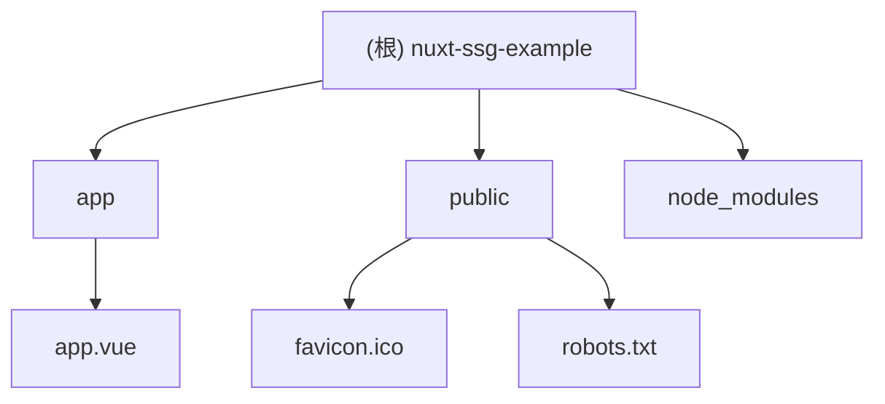

# nuxt-ssg-example - Nuxt.js 静态站点生成示例项目

> 项目愿景：提供一个简洁的 Nuxt.js 静态站点生成示例，展示现代前端开发最佳实践

## 架构总览

本项目采用 Nuxt.js 4.x 框架，基于 Vue 3 和 TypeScript，专注于静态站点生成(SSG)能力。项目结构遵循 Nuxt 4 的约定式目录结构，使用 pnpm 作为包管理器。



## 模块索引

| 模块 | 路径 | 职责描述 | 语言 |
|------|------|----------|------|
| app | `./app` | 应用核心组件和布局 | Vue 3 |
| public | `./public` | 静态资源文件 | 静态文件 |

## 运行与开发

### 环境要求
- Node.js 18+
- pnpm 10.6.2+

### 开发命令
```bash
# 安装依赖
pnpm install

# 开发模式
pnpm dev

# 构建项目
pnpm build

# 生成静态站点
pnpm generate

# 预览构建结果
pnpm preview
```

### 项目配置
- **框架**: Nuxt.js 4.2.1
- **Vue版本**: Vue 3.5.25
- **路由**: Vue Router 4.6.3
- **兼容性日期**: 2025-07-15
- **开发工具**: 已启用 Nuxt DevTools

## 测试策略

当前项目为示例项目，建议后续添加：
- 单元测试（Vitest）
- 组件测试（@vue/test-utils）
- 端到端测试（Playwright）

## 编码规范

- 使用 TypeScript 进行类型安全的开发
- 遵循 Vue 3 Composition API 规范
- 使用 pnpm 进行依赖管理
- 保持代码格式一致性（建议配置 ESLint + Prettier）

## AI 使用指引

1. **代码生成**: 优先使用 Vue 3 Composition API 和 TypeScript
2. **组件开发**: 遵循单文件组件（SFC）最佳实践
3. **状态管理**: 推荐使用 Pinia（如需添加）
4. **样式处理**: 支持 CSS Modules、SCSS、Tailwind CSS 等
5. **性能优化**: 利用 Nuxt 的自动代码分割和优化功能

## 变更记录 (Changelog)

### 2025-11-27
- 初始化项目 AI 上下文文档
- 添加项目架构说明和开发指南
- 创建模块结构图和索引表